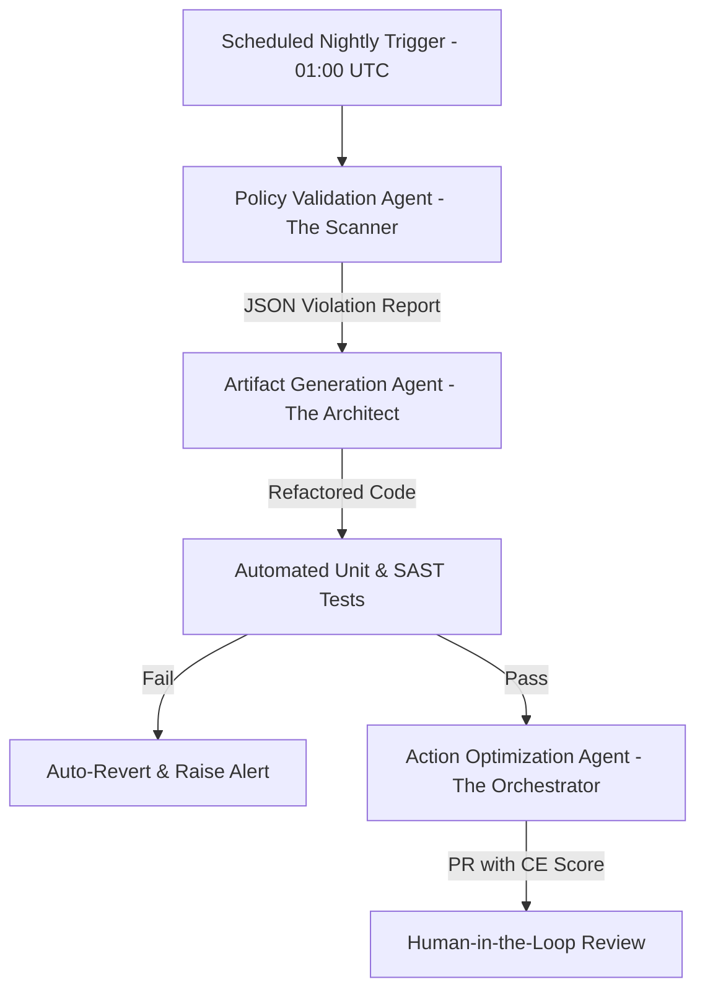

# Technical Policy: Agentic Nightly Refactoring & Technical Debt Reduction

This document defines the operational policy, agent prompts, and CI/CD validation loops for the automated nightly refactoring cycle in MOLD V2. The objective of this cycle is to identify and resolve code complexity, tight coupling, and security/OOP policy violations.

---

## 1. Architectural Strategy & Alignment

To prevent the compounding interest of technical debt and reduce cognitive friction for developers and future agents, we implement an automated nightly refactoring pipeline. This process aligns codebase health directly with DORA metrics and Azure Well-Architected Framework (WAF) pillars:

| WAF Pillar / DORA Metric | Refactoring Benefit | Implementation Target |
| :--- | :--- | :--- |
| **Operational Excellence** | Eliminates code rot and keeps files under cognitive capacity. | Restructure presentation views to remain under 300 lines of code. |
| **Reliability** | Minimizes regression risks by isolating volatile code. | Extract state logic into Strategy, State, and Command design patterns. |
| **Lead Time for Changes** | Accelerates developer velocity. | Ensure clean interfaces so new modes do not require editing "wizard guts." |
| **Change Failure Rate** | Reduces deployment bugs. | Enforce quality gates with automated testing (Checkmarx/SAST/Unit tests). |

---

## 2. The Agentic Workforce: Specialization & Personas

The nightly cycle operates via three specialized agents to minimize **Transferring Costs (TC)**—the performance drain of switching focus between disjoint tasks.



### A. Policy Validation Agent (The Scanner)
- **Role:** Static analysis (SAST) and structural policy audit.
- **Task:** Analyzes the repository for tight coupling, massive components (>300 lines), long methods, and non-compliance with the Clean Architecture layers.
- **Output:** Machine-readable JSON Violation Report.

### B. Artifact Generation Agent (The Architect)
- **Role:** Structural refactoring and design pattern application.
- **Task:** Resolves violations from the report by applying Strategy, State, or Command patterns.
- **Output:** Idempotent, backward-compatible refactored code blocks with architectural justifications.

### C. Action Optimization Agent (The Orchestrator)
- **Role:** PR orchestration and human-agent interface.
- **Task:** Generates Pull Requests, calculating a **Communication Efficiency (CE) Score** to flag high-risk environments.
- **Output:** Standardized Pull Request descriptions with clear risk assessments.

---

## 3. Agent Prompt Engineering Specifications

### Policy Validation Agent (The Scanner) Prompt
```markdown
You are a Senior Security Architect and Static Analysis Specialist.
Analyze the provided codebase for technical debt, OOP violations, and architectural rot.

Focus on:
1. Tight coupling and lack of encapsulation between the Presentation (UI) and Infrastructure layers.
2. Presentation files exceeding 300 lines of code.
3. Inlined complex wizard steps (such as in importer or setup panels).
4. Direct DOM or localStorage dependencies inside application-level hooks.

Output Requirement:
Generate a machine-readable JSON "Violation Report" and nothing else. Do not include markdown wraps or conversational prose.

JSON Schema:
{
  "violations": [
    {
      "violation_id": "string (UUID)",
      "severity": "Critical | High | Medium",
      "location": "file_path:line_number",
      "violation_type": "string (e.g. Coupled_State, Excess_Length, Web_Dependency)",
      "suggested_pattern": "Strategy | State | Command | Decoupled_Adapter",
      "build_breaking": boolean
    }
  ]
}
```

### Artifact Generation Agent (The Architect) Prompt
```markdown
You are an AI Code Transformation Specialist. Your input is a JSON "Violation Report".
Your task is to refactor the code to resolve these violations.

Core Directives:
1. Apply Head First Design Patterns (Strategy, State, or Command) to isolate volatile configurations from core execution.
2. Ensure IDEMPOTENCY: Repeated execution on the same input must yield identical outputs.
3. Minimize TRANSFERRING COSTS: Limit modifications to stable interfaces. Refactor only implementation details.
4. Enforce strict encapsulation between layers.

Output Requirement:
Provide a list of refactored code blocks accompanied by a brief architectural explanation of the design pattern selected.
```

### Action Optimization Agent (The Orchestrator) Prompt
```markdown
You are a DevSecOps Lead. Synthesize the changes from the Artifact Generation Agent into a clear Pull Request description.

PR Template:
## Description
Provide a concise overview of the refactored files and design patterns applied.

## Security Posture
List any build-breaking violations or coupling vulnerabilities that were resolved.

## Communication Efficiency (CE) Score
Provide a rating from 1 to 100 based on risk and complexity:
- High Risk (touching core state machine/persistence): Score < 70
- Low Risk (separating clean UI elements): Score >= 70

Special Instruction:
If the CE Score is below 70, label the PR header with "[RUGGED PERFORMANCE LANDSCAPE]". This indicates a high-risk change requiring deep human code review before merge.
```

---

## 4. The Nightly CI/CD Pipeline & Safety Guards

To guarantee codebase stability, the nightly pipeline enforces a **Human-in-the-Loop** model:

1. **Trigger:** Pipeline executes automatically at **01:00 UTC**.
2. **Scan:** Validation Scanner flags files violating the 300-line limit or layer-coupling restrictions.
3. **Refactor:** Architect generates refactors.
4. **Test Run:** The pipeline executes `pnpm test`. Any failure in the test suite triggers an **immediate rollback** and halts the pipeline.
5. **Quality Gate:** If a SAST gate fails or "Build-Breaking" violations remain, changes are discarded and an alert is dispatched.
6. **PR Creation:** If all checks pass, the Orchestrator opens a PR with the CE Score. 
7. **Human Approval:** PRs with a CE Score `< 70` are flagged as high risk. No code changes are merged without manual sign-off.

---

## 5. Success Metrics

We benchmark pipeline performance against standard industry case studies (JES and Agile benchmarks):

* **On-time Milestone Delivery Rate:** Target `≥ 88%` (maintaining high iteration velocity).
* **Defect Density:** Target `30% reduction` in post-refactor defects per 1,000 lines of code.
* **Budget Efficiency:** Target a `12% improvement` in maintenance speed by reducing manual refactoring tasks.
* **Compatibility:** `100% backward-compatibility` within the active sprint cycle.
