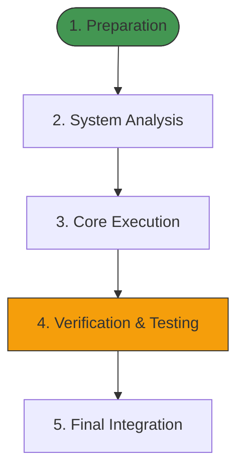

# Global Workflow: Create_workflow

A standardized, highly structured meta-workflow for converting the sequence of tasks, jobs, and problem-solving patterns from a chat session into a reusable, premium, and abstract workflow markdown file.

---

## 1. Overview & Trigger

This meta-workflow is triggered when the user requests to:
- "Save this chat's workflow"
- "Create a workflow from what we just did"
- "Package this sequence of jobs into a reusable recipe"
- Standardize a newly solved problem or recurring engineering pipeline for future agent execution.

The objective is to distill the concrete, session-specific actions (e.g., debugging a specific variable, editing a specific file) into a generalized, robust, and beautiful workflow stored in `.agent/workflows/<workflow_name>.md`.

---

## 2. Inputs & Context Gathering

Before generating the workflow, the agent must inspect:
1. **The Conversation Transcript**: Locate and parse the current conversation history (e.g., using `transcript.jsonl` or current context memory) to identify the chronology of events.
2. **Key Files & Code Artifacts**: Analyze the modified files, created scripts, test outputs, and specific system patterns utilized.
3. **Engineering Guidelines**: Review project documentation (like [AGENTS.md](file:///d:/Study/Programming/Projects/finalsv2/finals-qb/AGENTS.md) and [DEVELOPER_GUIDE.md](file:///d:/Study/Programming/Projects/finalsv2/finals-qb/DEVELOPER_GUIDE.md)) to align constraints.

---

## 3. Abstracting & Generalizing (The Distillation Phase)

To convert the session context into an abstract workflow, apply the following translation rules:

| Concrete Session Detail | Generalized Abstract Representation |
| :--- | :--- |
| Specific files (`components/mold/home-screen.tsx`) | Component layer placeholders (`components/mold/[component-name].tsx` or `[Target Component]`) |
| Specific debug print/log | Structured verification steps and assertion goals |
| Specific error string | Error class/category, troubleshooting steps, and mitigation strategies |
| Single terminal execution | Unified configuration options, required flags, and clean CLI command formats |

### Core Questions to Answer During Abstraction
- *What was the underlying structure or pattern of the problem?*
- *Which steps were exploratory (to be discarded) vs. structural (to be retained)?*
- *What are the pre-conditions (dependencies, file structures) required to start this workflow?*
- *How can future agents verify success at each individual phase?*

---

## 4. Workflow Document Structure (`.agent/workflows/<workflow_name>.md`)

Every generated workflow MUST be stored inside `.agent/workflows/` and adhere to the premium, neo-brutalist monospace data design. It must follow this exact markdown template:

```markdown
# Workflow: [Generalized_Workflow_Name]

[Provide a high-impact, 2-3 sentence overview of what this workflow accomplishes, the problem it solves, and when it should be triggered.]

---

## 1. Prerequisites & Dependencies

List all necessary environment setups, packages, permissions, or system states required before executing this workflow.

- [ ] **Dependency A**: (e.g. Node v18+, next-dev package, etc.)
- [ ] **Config Files**: (e.g. Ensure `.env.local` contains `API_KEY`)
- [ ] **Required Skills/Tools**: (e.g. `chrome-devtools`, `run_command` permission)

---

## 2. Structural Phase Blueprint



---

## 3. Step-by-Step Execution Protocol

Apply a strict, sequential step guide. Use monospace indicators for key variables.

### Phase 1: Preparation & Analysis
#### Step 1.1: [Step Title]
- **Action**: Detailed, concrete instructions of what tool to call or what directory to list.
- **Verification Goal**: How to know this step succeeded.
- **Failure Mitigation**: What to do if this step fails (e.g. permission error, file missing).

#### Step 1.2: [Step Title]
- ...

### Phase 2: Core Execution & Implementation
#### Step 2.1: [Step Title]
- **Action**: Describe the code changes, script runs, or modifications required.
- **Verification Goal**: Ensure compile/type checks pass.

> [!IMPORTANT]
> Highlight critical constraints, edge cases, or performance considerations here.

---

## 4. Verification & Testing Guidelines

Define exactly how the executing agent must verify the correctness of their work.

### Automated Test Protocols
- Command to run: `[Command Line String]`
- Expected output signature: `[Expected terminal output or test pass counts]`

### Manual / Visual Verification
- Steps to navigate or inspect via browser or devtools.
- Key properties to look out for.

---

## 5. Reference Materials & Seams

List related files, APIs, documentation pages, or potential seams/gotchas.

- **Related Files**: [`file_name.ts`](file:///absolute/path/to/file)
- **API Spec Reference**: [Link to docs or internal reference]
- **Known Seams**: Mention any fragile states or common pitfalls (e.g., hydration mismatches, async race conditions).
```

---

## 5. Registration & Catalog Updates

To ensure the newly created workflow is discoverable by future agents:
1. Save the workflow file using the kebab-case or snake_case format: `.agent/workflows/<workflow_name>.md`.
2. Update the main project documentation (e.g. [AGENTS.md](file:///d:/Study/Programming/Projects/finalsv2/finals-qb/AGENTS.md) or a central `.agent/workflows/README.md` catalog if it exists) to list the newly added workflow under the **Available Workflows** list.
3. Print a beautiful, concise summary of the newly generated workflow to the user, highlighting its name, file path, and pre-conditions.
