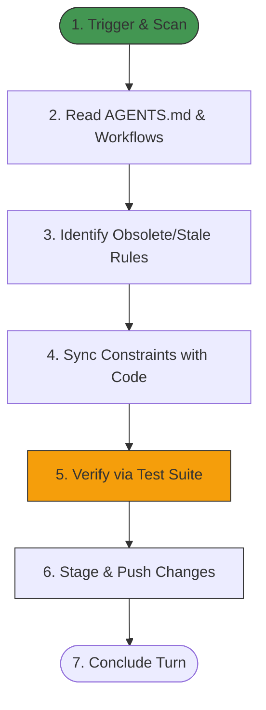

# Workflow: Self-Annealing Documentation and Rules (self_annealing)

This workflow defines the standardized, multi-step pipeline for inspecting, validating, and reconciling the project's documentation and rules (specifically `AGENTS.md` and related markdown files) to ensure they are synchronized with the latest features, constraints, and test verifications.

---

## 1. Prerequisites & Dependencies

- [ ] Access to the codebase with the `AGENTS.md` file in the project root.
- [ ] TypeScript and the unified test suite configured.
- [ ] Active Git tracking to stage and commit changes.

---

## 2. Structural Phase Blueprint



---

## 3. Step-by-Step Execution Protocol

### Step 1: Scan and Inspect Codebase Rules
- **Action**: Check if any rule in `AGENTS.md` (e.g. constraints, test commands, directories) conflicts with actual codebase implementation (such as package configurations or file locations).
- **Tooling**: Use `view_file` or `grep_search` to verify references to test commands, package managers, directory paths, or component naming schemas.

### Step 2: Remove or Update Obsolete Rules
- **Action**: Locate stale engineering constraints (e.g., outdated test commands, retired features, or redundant UI components). Update the description in `AGENTS.md` using `replace_file_content`.
- **Constraint Reconcile Checklist**:
  - Verify if test instructions are using the unified `pnpm test` wrapper.
  - Verify that the Auto-Fix Graceful Recovery rules are correctly specified (Rules 21, 22, 23).
  - Verify that command chaining limits (Rule 25) are preserved.

### Step 3: Local Test Execution & Validation
- **Action**: Run the unit test suite to verify no modifications broke the code behavior:
  ```bash
  pnpm test
  ```
- **Verification Goal**: All 132/132 tests pass with zero failures.

### Step 4: Commit and Push
- **Action**: If changes were made to documentation or rules, stage them, commit with a clear message prefix (`docs(agent): ...`), and push to the remote branch:
  ```bash
  git add AGENTS.md
  git commit -m "docs(agent): self-anneal and update codebase rules"
  git push origin main
  ```

---

## 4. Verification Guidelines
- **Command to run**:
  ```bash
  pnpm test
  ```
- **Expected Status**: Clean test execution with zero failures, and `git status` showing a clean working directory after the push.
