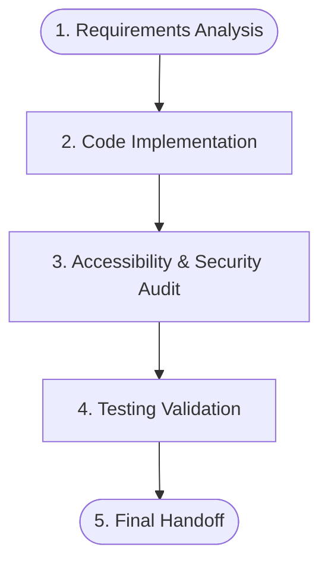

# Workflow: Full Feature Development Orchestration

An orchestration workflow for the holistic development of a new feature. This encompasses code implementation, UI/accessibility compliance, and testing verification.

---

## 1. Prerequisites & Dependencies

- Clear feature requirements.
- Knowledge of the component structure (e.g., UI vs Mold components).

---

## 2. Phase Blueprint

---

## 3. Execution Protocol

### Phase 1: Implementation
- **Action**: Modify or create necessary files based on requirements. Adhere to coding standards (early returns, map/dict over switches). Do not mock db instances, use local/session storage.

### Phase 2: Audit
- **Action**: Invoke the narrow agent workflow `.agent/workflows/a11y_audit.md` on the newly modified files to ensure focus rings, ARIA labels, and live regions are correctly applied.
- **Action**: Ensure logging uses proper redaction patterns (declarative capture groups) according to `.Jules/logging.md`.

### Phase 3: Validation
- **Action**: Invoke `.agent/workflows/run_tests.md` to run the entire test suite and ensure no regressions occurred.

---

## 4. Final Handoff
- Submit PR or complete task only when all tests pass and audits are clear.
