# finals-qb

A dark-first, game-like educational quiz platform built with Next.js, TypeScript, Tailwind CSS, and a custom “Mastery Protocol” game system.

Live app: ([HERE](https://finals-qb.vercel.app))

## Overview

`finals-qb` is a quiz and revision platform focused on making question practice feel like an interactive game session rather than a static test bank. The project includes:
- multiple quiz/game modes
- a session-based game engine
- achievements and progression
- flashcards and terminology review
- local persistence for runs and unlocks
- a dark neo-brutalist UI system

The repository is primarily TypeScript, with supporting CSS and small amounts of JavaScript and shell. ([github.com](https://github.com/AhmedNasser-bug/finals-qb))

## Tech Stack

- Next.js
- React
- TypeScript
- Tailwind CSS
- shadcn/ui
- localStorage-based persistence
- Geist fonts

The repo includes standard Next/Tailwind project files such as `next.config.mjs`, `tailwind.config.ts`, `postcss.config.mjs`, `tsconfig.json`, and `components.json`. ([github.com](https://github.com/AhmedNasser-bug/finals-qb))

## Repository Structure

Top-level folders and key files include: ([github.com](https://github.com/AhmedNasser-bug/finals-qb))

```text
app/                  # App Router pages, layout, globals
components/           # UI and feature components
docs/                 # Project docs
lib/                  # Types, engines, stores, utilities
public/               # Static assets
scripts/              # Utility scripts
styles/               # Styling support

AGENTS.md             # Agent/source-of-truth project documentation
DEVELOPER_GUIDE.md    # Developer-facing guide
README.md             # Repository overview
package.json          # Scripts and dependencies
docker-compose.yml    # Container/dev setup
test-runner.mjs       # Test runner entry
proxy.ts              # Project proxy/middleware-related entry
```

## Core Product Areas

Based on the project structure and internal documentation, the app is organized around:
- a home/setup flow
- a game session runner
- question answering modes
- flashcard review
- achievements
- run history and performance tracking
- subject-driven content loading

The codebase includes dedicated `app`, `components`, and `lib` layers, plus internal documentation intended to guide contributors and agents. ([github.com](https://github.com/AhmedNasser-bug/finals-qb))

## Getting Started

### Prerequisites

Use one of:
- Node.js 18+
- npm or pnpm

### Install

```bash
npm install
```

or

```bash
pnpm install
```

### Run locally

```bash
npm run dev
```

or

```bash
pnpm dev
```

Then open:

```text
http://localhost:3000
```

## Available Files You Should Read First

If you are contributing, read these before making changes:
- `AGENTS.md`
- `DEVELOPER_GUIDE.md`
- `lib/` shared types and engine files
- `components/` feature entry points

These files are present in the repo root and are intended to document architecture and contribution expectations. ([github.com](https://github.com/AhmedNasser-bug/finals-qb))

## Development Notes

This project appears to be structured for:
- App Router-based UI organization under `app/`
- component-driven feature development under `components/`
- shared logic and state in `lib/`
- project documentation in `docs/` and root markdown files

Because the app includes both `package-lock.json` and `pnpm-lock.yaml`, use one package manager consistently in your local workflow. ([github.com](https://github.com/AhmedNasser-bug/finals-qb))

## Running with Docker

A `docker-compose.yml` file is included in the repository. If your team uses Docker-based development, you can adapt your workflow around that file. ([github.com](https://github.com/AhmedNasser-bug/finals-qb))

## Deployment

The repository links to a deployed app on Vercel. ([github.com](https://github.com/AhmedNasser-bug/finals-qb))

## Contributing

1. Fork the repo
2. Create a feature branch
3. Make focused changes
4. Test locally
5. Open a pull request

The repository currently has pull requests enabled and is publicly accessible on GitHub. ([github.com](https://github.com/AhmedNasser-bug/finals-qb))

## Notes

- The repo is public. ([github.com](https://github.com/AhmedNasser-bug/finals-qb))
- The main branch is `main`. ([github.com](https://github.com/AhmedNasser-bug/finals-qb))
- The project includes extensive internal guidance files for contributors. ([github.com](https://github.com/AhmedNasser-bug/finals-qb))

## License

Add your project license here if you want distribution terms to be explicit.


# Architecture Diagrams

## Overview

The finals-qb architecture consists of these major sections:

1. **App Router & Entry Point** — Next.js pages and root layout
2. **Provider Layer** — Global state contexts
3. **Home Screen Flow** — Mode selection and setup
4. **Game Session Flow** — Active game play and interaction
5. **State Management** — React state and context consumers
6. **Engine & Logic** — Game engine and achievement evaluator
7. **Data & Types** — Centralized type system and data store
8. **Persistence** — localStorage and async interface
9. **UI System** — Design tokens, Tailwind, shadcn/ui
10. **Session Complete Flow** — End-to-end game completion
11. **Achievement Unlock Flow** — Achievement evaluation and notification

---

## 1. App Router & Entry Point

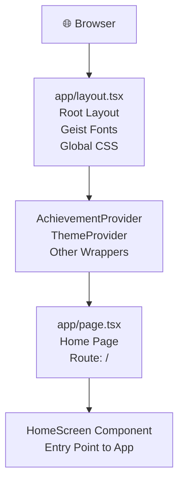

---

## 2. Provider Layer

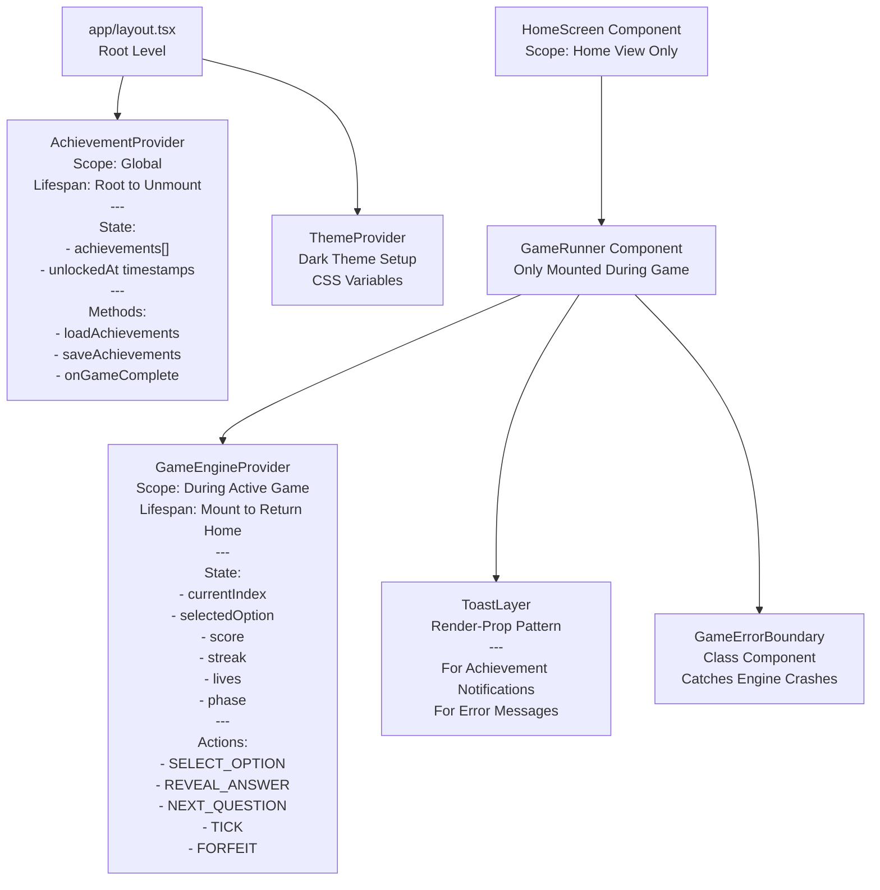

---

## 3. Home Screen Flow

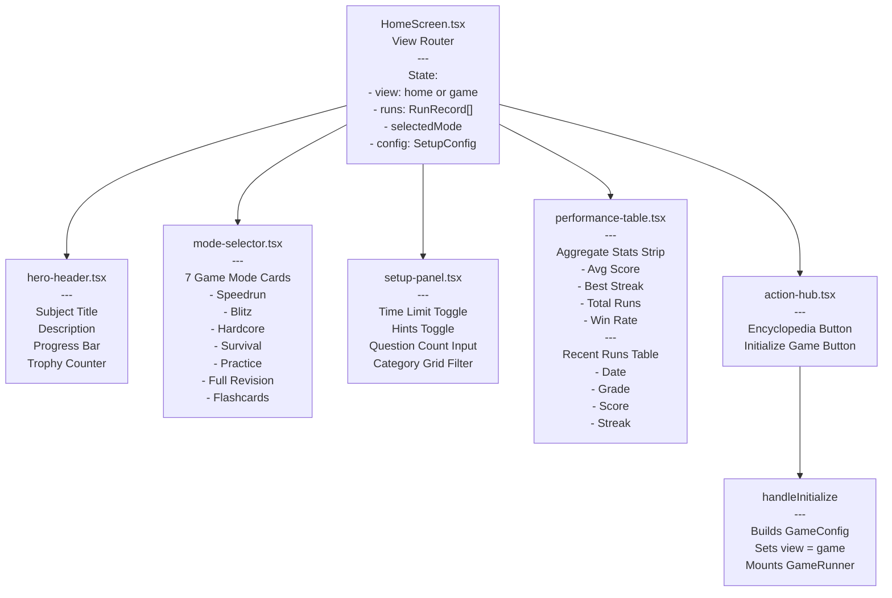

---

## 4. Game Session Flow

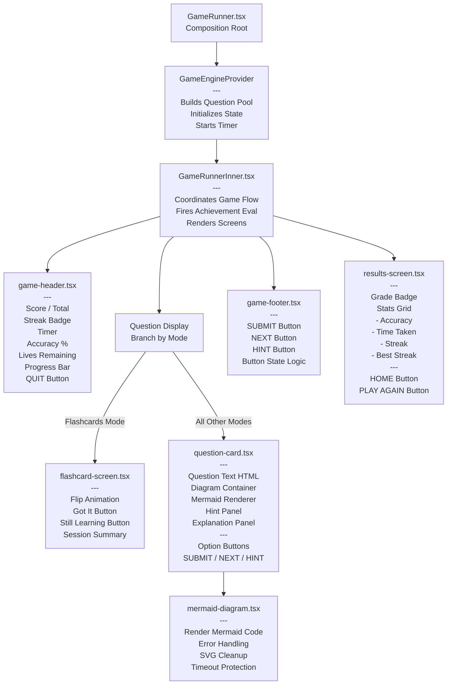

---

## 5. State Management

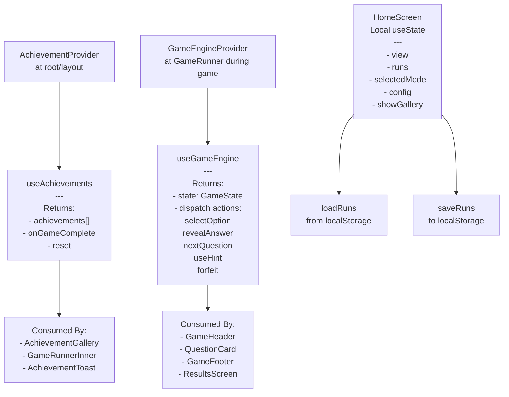

---

## 6. Engine & Logic Layer

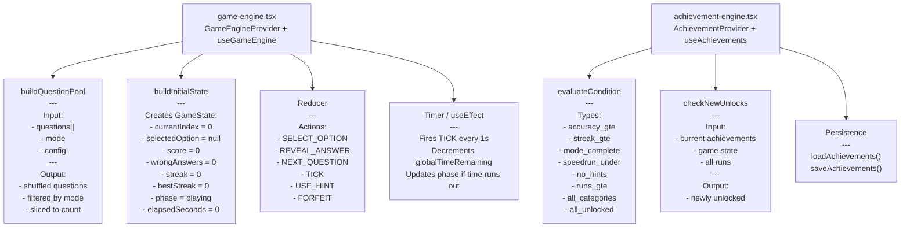

---

## 7. Data & Types

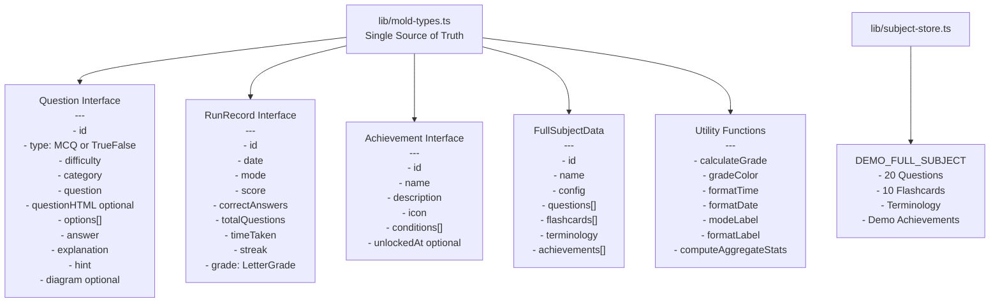

---

## 8. Persistence Layer

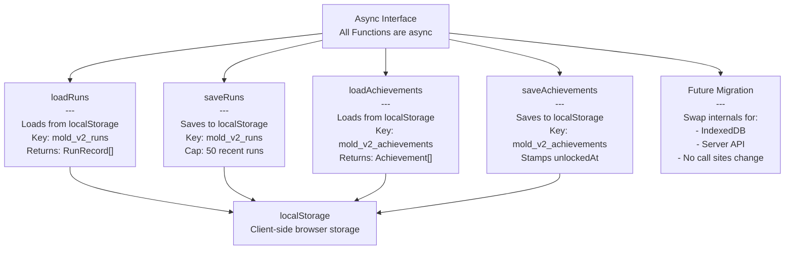

---

## 9. UI System

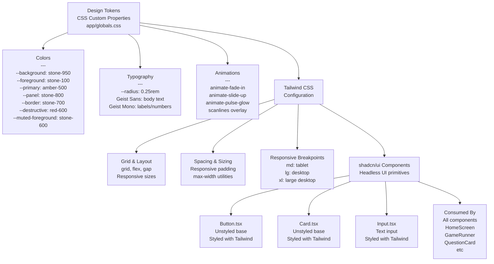

---

## 10. Session Complete Flow

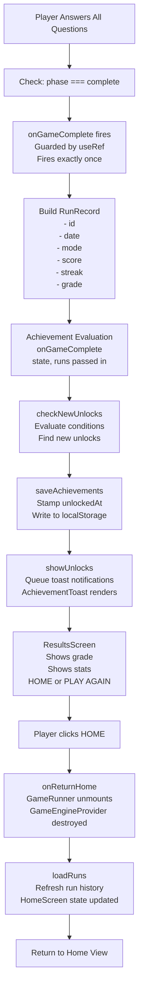

---

## 11. Achievement Unlock Flow

```mermaid
graph TD
    Complete["Game Completes<br/>phase = complete"]
    
    Complete --> FireOnce["onGameComplete<br/>Fires exactly once<br/>Ref guard: achievementsFiredRef"]
    
    FireOnce --> LoadCurrent["Load current achievements<br/>From localStorage<br/>Key: mold_v2_achievements"]
    
    LoadCurrent --> PassParams["Pass to checkNewUnlocks<br/>- current: Achievement[]<br/>- state: GameState<br/>- allRuns: RunRecord[]"]
    
    PassParams --> EvaluateAll["Evaluate all conditions<br/>For each condition type<br/>- accuracy_gte<br/>- streak_gte<br/>- mode_complete<br/>- speedrun_under<br/>- no_hints<br/>- runs_gte<br/>- all_categories<br/>- all_unlocked"]
    
    EvaluateAll --> FindNew["Find newly unlocked<br/>Before: achievement not in current<br/>After: condition passes now"]
    
    FindNew --> StampTime["Stamp unlockedAt<br/>Achievement.unlockedAt = now"]
    
    StampTime --> SaveBack["saveAchievements<br/>Write back to localStorage<br/>Persisted array with timestamps"]
    
    SaveBack --> UpdateState["useAchievements<br/>React state updates<br/>achievements[] changes"]
    
    UpdateState --> QueueToast["showUnlocks<br/>useAchievementToast<br/>Queue for render"]
    
    QueueToast --> RenderToast["AchievementToastContainer<br/>Renders stack<br/>Each toast auto-dismisses 4.5s"]
    
    RenderToast --> Done["Toast fades<br/>User sees unlock notification"]
```

---

## Connections Summary

All three levels connect like:

```
Providers (global state)
  ↓
Components (consume with hooks)
  ↓
Engines (game-engine, achievement-engine)
  ↓
Data Layer (mold-types, subject-store)
  ↓
Persistence (localStorage + async interface)
  ↓
UI System (tokens, tailwind, shadcn/ui)
```

---

## Architecture Narrative

### Layer 1: Entry & Routing
- **`app/layout.tsx`** — Root provider wrapper, global styles, Geist font setup
- **`app/page.tsx`** — Mounts `<HomeScreen />`

### Layer 2: State Management
Three independent provider contexts:
- **`AchievementProvider`** — Persisted achievements, unlock evaluation, global scope
- **`GameEngineProvider`** — Ephemeral game state, question pool, timer; scoped to active session
- **`HomeScreen`** — Local state for view, runs, mode selection, config

### Layer 3: Component Hierarchy
- **Home view** — mode selector, setup panel, performance table, hero header
- **Game view** — GameRunner wraps GameEngineProvider → GameRunnerInner → header/card/footer
- **Modals** — Achievement gallery, toast notifications, error boundary
- **Specialized** — Flashcard screen (no engine), Mermaid diagram renderer (with error handling)

### Layer 4: Game Logic
- **`game-engine.tsx`** — Question pool builder, state reducer, turn-based flow, timer tick
- **`achievement-engine.tsx`** — Condition evaluator, unlock checker, localStorage sync

### Layer 5: Data & Types
- **`lib/mold-types.ts`** — Single source of truth for all types, utility functions, game mode registry
- **`lib/subject-store.ts`** — Demo question bank, flashcards, terminology, achievements

### Layer 6: Persistence
- **localStorage** — Async interface ready for IndexedDB/server migration
- **Keys**: `mold_v2_runs`, `mold_v2_achievements`

### Layer 7: UI System
- **Design tokens** — CSS custom properties (dark, amber primary, neo-brutalist)
- **shadcn/ui** — Button, Card, Input, Dialog primitives
- **Tailwind CSS** — Layout, spacing, animations, responsive design

### Layer 8: External
- **Next.js 16 + React 19** — App Router, server/client boundaries
- **Mermaid.js** — Diagram rendering with error handling
- **Geist** — Typography (Mono for labels, Sans for body)

---

## Session Flow

```
HomeScreen (select mode + config)
  ↓
handleInitialize()
  ↓
GameRunner mounts with config + questions
  ↓
GameEngineProvider builds initial state + timer starts
  ↓
GameRunnerInner renders GameHeader/QuestionCard/GameFooter
  ↓
Player selects option → SELECT_OPTION action
  ↓
QuestionCard highlights selection
  ↓
Player presses SUBMIT → REVEAL_ANSWER action
  ↓
reducer updates score/streak/wrongAnswers
  ↓
Player presses NEXT or FORFEIT
  ↓
currentIndex advances or phase → "complete"
  ↓
ResultsScreen renders with grade
  ↓
Player clicks HOME → onReturnHome()
  ↓
GameRunner unmounts → GameEngineProvider destroyed
  ↓
HomeScreen calls loadRuns() to refresh history
```

---

## Achievement Evaluation Flow

```
Player completes game session
  ↓
onGameComplete(state, runs) fires exactly once via ref guard
  ↓
achievement-engine loads current achievements from localStorage
  ↓
checkNewUnlocks(current, state, allRuns) evaluates conditions
  ↓
Finds newly unlocked achievements
  ↓
Stamps unlockedAt timestamp
  ↓
saveAchievements() persists back to storage
  ↓
useAchievements React state updates
  ↓
showUnlocks(newAchievements) queues toast notifications
  ↓
AchievementToast renders in fixed stack with auto-dismiss
```

---

## Key Architectural Rules

1. **`GameEngineProvider` is ephemeral** — mounted per session, destroyed on return home
2. **`AchievementProvider` is persistent** — root-level, survives navigation
3. **All types centralized** — `lib/mold-types.ts` is the source of truth
4. **Accuracy denominator is `score + wrongAnswers`** — not `currentIndex`
5. **Achievement evaluation fires exactly once** — guarded by `useRef`
6. **Toast layer wraps everything** — `ToastLayer` render-prop keeps hooks above conditionals
7. **Mermaid diagrams are optional** — questions without `diagram` render normally
8. **localStorage interface is async** — ready for IndexedDB/server migration
