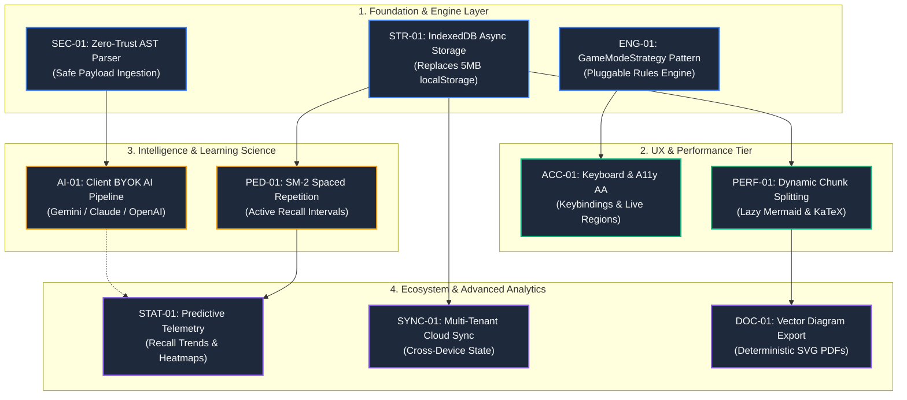
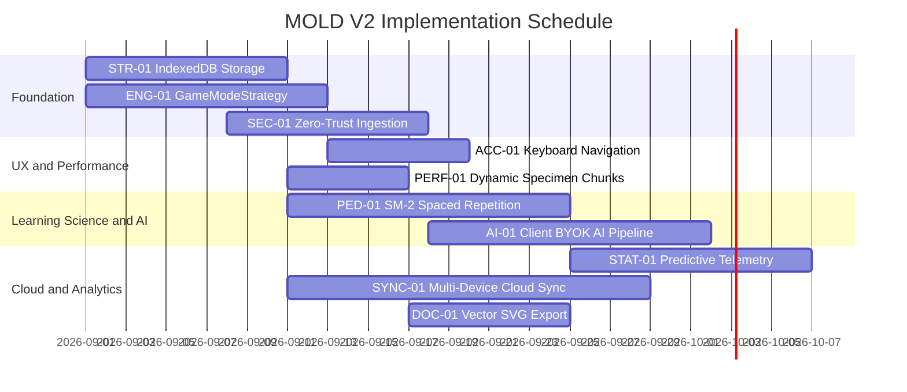
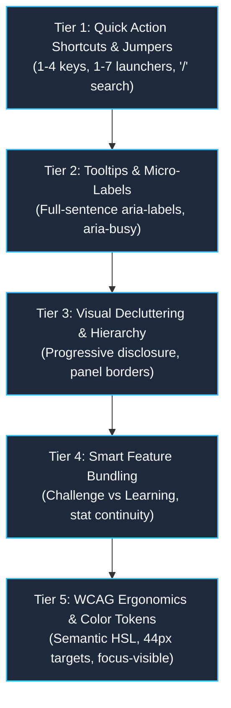

# MOLD V2 (Mastery Protocol) — Key Areas of Improvement & Architectural Roadmap

This document serves as the comprehensive engineering roadmap, architectural critique, and prioritized improvement catalog for the **MOLD V2 / Finalist** educational mastery platform. It synthesizes findings across cognitive learning science, the Well-Architected Framework (WAF), WCAG 2.2 accessibility standards, React 19 / Next.js 16 performance patterns, and enterprise-grade resilience.

---

## 1. Master Priority & Effort vs. Impact Matrix

| ID | Focus Area | Subsystem | Current State | Proposed Target Architecture | Priority | Effort | Impact |
| :--- | :--- | :--- | :--- | :--- | :---: | :---: | :---: |
| **ENG-01** | **Game Mode Strategy Pattern** | `lib/game/game-engine.tsx` | Mode-specific rules (Survival lives/timers, Speedrun caps) hardcoded in reducer switch-cases. | Pluggable `GameModeStrategy` registry enabling runtime custom user mode creation. | **P1** | Medium | High |
| **STR-01** | **IndexedDB Asynchronous Storage** | `lib/subject/subject-persistence.ts` | Synchronous `localStorage` with 5MB quota and main-thread I/O bottlenecks. | Asynchronous `idb` storage layer with quota management and fallback. | **P1** | Medium | High |
| **ACC-01** | **Keyboard-First Navigation & A11y** | `components/mold/game/` | Mouse-only input; lack of assertive ARIA countdown announcements. | Full WCAG 2.2 AA compliance: `1-4`/`A-D` option keys, `Space`/`Enter` flow, live regions. | **P1** | Low | High |
| **PED-01** | **Spaced Repetition (SM-2 SRS)** | `components/mold/flashcard/` | Flashcard state is ephemeral in-memory (`Set<string>`) and lost on navigation. | SuperMemo-2 (SM-2) algorithm scheduling flashcards by memory interval and ease factor. | **P2** | Medium | High |
| **PERF-01**| **Dynamic Visual Specimen Splitting** | `components/mold/common/` | KaTeX and Mermaid 11.15.0 eagerly loaded or large initial chunks. | Strictly lazy-loaded chunks gated by `hasVisual(q)` check at runtime. | **P2** | Low | Medium |
| **AI-01**  | **Client-Side BYOK AI Pipeline** | `components/mold/home/` | Manual 5-step copy-paste prompt loop to external web chatbots. | Direct browser-to-LLM client (Gemini/Claude/OpenAI) for 1-click generation & Socratic tutor. | **P2** | Medium | High |
| **SEC-01** | **Zero-Trust Client Ingestion & AST** | `lib/subject/subject-persistence.ts` | Regex heuristics for JSON malformations and unescaped LaTeX backslashes. | WebAssembly AST parser or tokenizer with auto-repair and strict Zod runtime verification. | **P2** | Medium | High |
| **SYNC-01**| **Multi-Tenant Cloud Sync Engine** | `lib/utils/user-storage.ts` | Clerk only namespaces client `localStorage` keys; no cross-device sync. | Hybrid offline-first sync (IndexedDB $\leftrightarrow$ Supabase/KV) with conflict resolution. | **P3** | High | High |
| **STAT-01**| **Predictive Telemetry & Analytics** | `lib/game/stats-context.tsx` | Static aggregate stats (averages, best streak) without temporal learning trends. | Linear regression on reaction times, topic decay heatmaps, and custom milestone rules. | **P3** | Medium | Medium |
| **DOC-01** | **Vector Diagram Specimen Export** | `lib/subject/subject-sharing.ts` | PDF/HTML export depends on client browser rendering of Mermaid SVGs. | Pre-rendered static SVG inline embedding for deterministic offline PDF/print outputs. | **P3** | Medium | Low |

---

## 2. Deep-Dive Improvement Catalog by Domain

### 2.1. Core Engine & Architectural Decoupling

| Property | Specification & Architectural Blueprint |
| :--- | :--- |
| **Module** | `lib/game/game-engine.tsx`, `lib/game/streak-shield-logic.ts`, `lib/types/mold-types.ts` |
| **Current Architectural Seam** | Although question filtering uses `POOL_BUILDERS`, `reducer()` contains hardcoded branch logic for `"survival"`, `"speedrun"`, and `"blitz"`. Adding a custom mode currently requires modifying 4 core files. |
| **Target Architecture** | **Strategy Pattern & Strategy Registry**: Separate the state machine loop from gameplay rules. |
| **Code Contract Blueprint** | ```typescript<br>export interface GameModeStrategy {<br>  id: GameModeId | string;<br>  label: string;<br>  category: "challenge" | "learning";<br>  tag: string;<br>  hasGlobalTimer: boolean;<br>  getGlobalTimeLimit: (config: GameConfig) => number;<br>  getPerQuestionTimeLimit: (currentIndex: number, config: GameConfig) => number;<br>  initialLives: number; // 0 = unlimited<br>  hintsAllowed: boolean;<br>  buildQuestionPool: (questions: Question[], config: GameConfig) => Question[];<br>  onAnswerReveal: (state: GameState, isCorrect: boolean) => Partial<GameState>;<br>  onTick?: (state: GameState) => Partial<GameState> | null;<br>  calculateAccuracy: (score: number, wrong: number) => number;<br>}<br>``` |
| **User Benefits** | Unlocks a **Custom Mode Creator** UI allowing instructors/students to craft customized challenge presets (e.g. "Rapid True/False Marathon", "No-Hint Sudden Death"). |

---

### 2.2. Persistence, Storage & Memory Hygiene (WAF Reliability)

| Property | Specification & Architectural Blueprint |
| :--- | :--- |
| **Module** | `lib/subject/subject-persistence.ts`, `lib/utils/user-storage.ts` |
| **Current Architectural Seam** | `localStorage` synchronous blocking. Question banks containing 150+ questions with embedded LaTeX, Mermaid markup, and HTML code blocks consume 1–3 MB, nearing the 5 MB browser quota. |
| **Target Architecture** | **Asynchronous IndexedDB Storage Driver (`idb` / Dexie-style wrapper)** with automatic legacy `localStorage` migration. |
| **Key Directives** | 1. **Zero Thread-Blocking:** Parse and stringify large JSON blobs off the main UI thread.<br>2. **Storage Quota Resilience:** Expand local capacity from 5 MB to > 500 MB for offline question caching and media attachments.<br>3. **Transactional Commit:** Ensure subject updates write atomically without risking data loss on tab closure. |
| **Migration Plan** | ```typescript<br>export async function getStorageDriver(): Promise<StorageAdapter> {<br>  if (typeof window !== "undefined" && "indexedDB" in window) {<br>    return new IndexedDbAdapter("mold_v2_db");<br>  }<br>  return new LocalStorageFallbackAdapter();<br>}<br>``` |

---

### 2.3. Learning Science & Spaced Repetition (SM-2 Algorithm)

| Property | Specification & Architectural Blueprint |
| :--- | :--- |
| **Module** | `components/mold/flashcard/flashcard-screen.tsx`, `lib/subject/subject-store.ts` |
| **Current Architectural Seam** | Flashcard and Terminology review sessions are purely transient. Marking a card as "Got It" or "Still Learning" has no lasting effect on future study sessions. |
| **Target Architecture** | **SuperMemo-2 (SM-2) Local Memory Engine**: Schedules active recall intervals based on historical recall friction. |
| **Mathematical Formulation** | - **Response Quality ($q \in [0, 5]$)**: Derived from time-to-reveal and user rating.<br>- **Ease Factor Update**: $EF' = \max\left(1.3, EF + (0.1 - (5 - q) \cdot (0.08 + (5 - q) \cdot 0.02))\right)$<br>- **Interval Scheduling ($I$)**: $I(1) = 1\text{ day}, I(2) = 6\text{ days}, I(n) = I(n-1) \cdot EF'$ |
| **UI Integration** | 1. **"Due Today" Badge:** Displays scheduled active recall items on the hero header.<br>2. **Targeted Flashcard Decks:** Dynamically creates study pools containing only items due for spaced review. |

---

### 2.4. AI Generation & Client-Side BYOK Workflow

| Property | Specification & Architectural Blueprint |
| :--- | :--- |
| **Module** | `components/mold/home/add-questions-wizard.tsx`, `lib/subject/prompt-builder.ts` |
| **Current Architectural Seam** | Users must manually copy formatted markdown prompts into third-party web apps (ChatGPT/Claude/Gemini) and copy the resulting JSON back into MOLD V2. |
| **Target Architecture** | **Client-Side Bring-Your-Own-Key (BYOK) Connector**: Direct browser-to-API communication using user-supplied keys stored strictly in browser session memory. |
| **Supported Providers** | Google Gemini API (`@google/genai`), Anthropic API, OpenAI-compatible endpoints. |
| **Features** | 1. **1-Click Generation:** Single-click question bank creation from syllabus PDFs or topic outlines.<br>2. **In-Game Socratic AI Tutor:** Contextual hints generated in real-time when a student selects an incorrect answer. |

---

### 2.5. Accessibility (WCAG 2.2 Level AA) & Power-User Controls

| Property | Specification & Architectural Blueprint |
| :--- | :--- |
| **Module** | `components/mold/game/question-card.tsx`, `components/mold/game/game-header.tsx`, `components/mold/game/game-footer.tsx` |
| **Current Architectural Seam** | Interaction requires mouse clicks or screen taps. Timed countdowns lack accessible live regions for visually impaired students. |
| **Target Architecture** | Full **Keyboard Navigation Matrix** and **Dynamic Screen Reader Live Regions**. |
| **Actionable Matrix** | | Key / Element | Action Triggered | Accessibility Token |<br>| :--- | :--- | :--- |<br>| `1`, `2`, `3`, `4` or `A`, `B`, `C`, `D` | Select corresponding MCQ option | `aria-selected="true"`, `focus-visible` |<br>| `Space` / `Enter` | Submit selected option / Advance to next question | `role="button"` |<br>| `H` | Toggle Socratic Hint accordion | `aria-expanded` |<br>| `Esc` | Trigger Forfeit / Cheat Sheet | `aria-haspopup="dialog"` |<br>| **Low Time Warning (<5s)** | Trigger urgent speech announcement | `<div role="alert" aria-live="assertive">` | |

---

### 2.6. Performance, Bundle Optimization & Build Hygiene

| Property | Specification & Architectural Blueprint |
| :--- | :--- |
| **Module** | `components/mold/common/mermaid-diagram.tsx`, `lib/utils/math-renderer.ts`, `package.json` |
| **Current Architectural Seam** | 1. Mermaid (`~300KB+`) and KaTeX css/fonts add weight to bundles even during text-only questions.<br>2. Node.js typeless CommonJS warning during `pnpm test`. |
| **Target Architecture** | **Strict Specimen Dynamic Splitting & Module Harmonization**: |
| **Optimization Actions** | 1. **Strict Runtime Gating:** Ensure Mermaid and KaTeX chunks are loaded via `next/dynamic` strictly when `hasVisual(question)` returns `true`.<br>2. **ESM Declaration:** Add `"type": "module"` to `package.json` to accelerate module resolution in test runners. |

---

### 2.7. Security, Ingestion Defense & Zero-Trust Architecture (WAF Security)

| Property | Specification & Architectural Blueprint |
| :--- | :--- |
| **Module** | `lib/subject/subject-persistence.ts`, `lib/utils/logger.ts`, `components/mold/common/mermaid-diagram.tsx` |
| **Current Architectural Seam** | LLM outputs can contain malicious script injections in explanations or malformed escape sequences that break JSON deserialization. |
| **Target Architecture** | **Multi-Stage Sanitization & AST Auto-Repair Pipeline**: |
| **Defense-in-Depth Steps** | 1. **Lexical Normalizer:** Pre-scans raw strings to escape unescaped backslashes in LaTeX strings (`\alpha` $\rightarrow$ `\\alpha`).<br>2. **DOMPurify Client-Side Scrub:** Sanitizes all explanation and visual HTML through `isomorphic-dompurify` prior to DOM insertion.<br>3. **Mermaid Sandboxing:** Enforces `securityLevel: 'strict'` to prevent SVG script execution.<br>4. **JSON Patcher:** Uses brace-counting stack automata to splice deformed JSON blocks. |

---

### 2.8. Telemetry, Analytics & Predictive Learning Trends

| Property | Specification & Architectural Blueprint |
| :--- | :--- |
| **Module** | `lib/game/stats-context.tsx`, `components/mold/home/stats-screen.tsx` |
| **Current Architectural Seam** | Telemetry currently records aggregate totals (`totalRuns`, `averageScore`, `bestStreak`), missing historical velocity and concept weakness maps. |
| **Target Architecture** | **Time-Series Learning Velocity & Category Decay Matrix**: |
| **Key Metrics** | 1. **Recall Latency Trend:** Linear regression on millisecond response times per category.<br>2. **Category Vulnerability Index:** Identifies syllabus topics with accuracy $<70\%$ and flags them for targeted Practice drills.<br>3. **Streak Ascent Velocity:** Tracks flame progression milestones across daily study cycles. |

---

## 3. Feature Dependency Graph & Implementation Roadmap

### 3.1. Architectural Dependency Graph

The following Directed Acyclic Graph (DAG) defines the strict architectural dependency sequence. Foundational subsystems (Storage, Strategy Engine, Ingestion Security) must be cleared before dependent capabilities (Spaced Repetition, BYOK AI, Cloud Sync, and Predictive Telemetry) can be safely integrated.



---

### 3.2. Implementation Timeline & Gantt Schedule

The implementation schedule is presented below using universal ISO date formatting for maximum rendering compatibility across all Markdown and Mermaid parser engines.



---

### 3.3. Phase Milestone Timeline Matrix

For environments where Gantt parser modules are restricted, the following horizontal timeline provides an identical schedule and dependency progression:

```mermaid
flowchart LR
    %% Phase 1
    subgraph P1 ["Phase 1: Foundation (Sep 01 - Sep 18)"]
        direction TB
        T1["STR-01: IndexedDB Storage (Sep 01 - 11)"]
        T2["ENG-01: Strategy Engine (Sep 01 - 13)"]
        T3["SEC-01: Ingestion AST (Sep 08 - 18)"]
    end

    %% Phase 2
    subgraph P2 ["Phase 2: Core UX & Science (Sep 11 - Oct 02)"]
        direction TB
        T4["ACC-01: Keyboard & A11y (Sep 13 - 20)"]
        T5["PERF-01: Specimen Chunking (Sep 11 - 17)"]
        T6["PED-01: SM-2 Spaced Repetition (Sep 11 - 25)"]
        T7["AI-01: Client BYOK AI (Sep 18 - Oct 02)"]
    end

    %% Phase 3
    subgraph P3 ["Phase 3: Cloud & Analytics (Sep 11 - Oct 07)"]
        direction TB
        T8["SYNC-01: Cloud Sync (Sep 11 - 29)"]
        T9["DOC-01: Vector Export (Sep 17 - 25)"]
        T10["STAT-01: Predictive Telemetry (Sep 25 - Oct 07)"]
    end

    %% Sequence flow
    P1 ==> P2 ==> P3

    %% Styling
    classDef phaseBox fill:#0f172a,stroke:#3b82f6,stroke-width:2px,color:#f8fafc;
    classDef card fill:#1e293b,stroke:#64748b,stroke-width:1px,color:#f1f5f9;
    class P1,P2,P3 phaseBox;
    class T1,T2,T3,T4,T5,T6,T7,T8,T9,T10 card;
```



---

## 4. Verification & Quality Gates

Every implementation phase must satisfy the following automated quality benchmarks before landing:
1. **Zero Test Regressions:** All 184+ unit/integration tests must pass via `pnpm test`.
2. **Accessibility Audits:** Automated Lighthouse / axe-core audits must yield **100% a11y compliance** on all active game screens.
3. **Bundle Budget Checks:** Initial route bundles must remain under 120 KB gzip (excluding dynamic KaTeX/Mermaid assets).
4. **Offline Isolation:** 100% of quiz taking, scoring, and flashcard active recall must function with zero network connectivity.

---

## 5. UI/UX, Interaction Ergonomics & Accessibility Investigation (Tiers 1–5)

This section details the systematic audit and target architecture across the 5 specialized UI/UX, Ergonomics, and Accessibility tiers.



---

### 5.1. Tier 1: Quick Action Shortcuts & Process Jumpers

| Item / Feature | Affected Code Files | Current Codebase State | Target Architecture & Actionable Fix |
| :--- | :--- | :--- | :--- |
| **In-Game Hotkeys**<br>`[1-4]`, `[↵]`, `[H]`, `[ESC]` | `components/mold/game/game-runner.tsx`<br>`components/mold/game/question-card-builder.tsx`<br>`components/mold/game/game-footer.tsx` | Partial handler in `game-runner.tsx` lines 198–248. Crucial defect: `if (state.phase !== "playing") return` blocks `Enter`/`Space` during `phase === "reviewing"`, preventing advance on keypress. Option cards lack visual `[1]`, `[2]` badges. | 1. Extend `handleKeyDown` to handle `phase === "reviewing"` for advance.<br>2. Add `[1]..[4]` / `[A]..[D]` visual key pills inside `OptionItem`.<br>3. Bind `Esc` to toggle the Cheat Sheet terminal or prompt forfeit confirmation. |
| **One-Tap Parameter Presets**<br>(Default, Mastery, Reset) | `components/mold/home/setup-panel-blocks.tsx`<br>`components/mold/home/setup-panel.tsx` | Only a single `"RESET DEFAULTS"` button exists in `ConfigControls` toolbar. | Introduce a 3-button quick preset strip:<br>• **Default:** (Timer: ON, Hints: OFF, Count: 20)<br>• **Mastery:** (Timer: OFF, Hints: OFF, Count: ALL)<br>• **Speed Drill:** (Timer: ON, Hints: OFF, Count: 10) |
| **Direct Mode Launchers**<br>Key Cues `[1]`–`[7]` | `components/mold/home/mode-selector.tsx`<br>`components/mold/home/home-screen.tsx` | Mode cards show index numbers (`1..7`) in badge UI, but keyboard number listeners are not attached at the Home Screen level. | Implement a root `useEffect` on `HomeScreen` that captures keys `1`–`7` to instantly select the mode, and double-tap / `Enter` to immediately launch. |
| **Global Search Focus**<br>`'/'` Hotkey | `components/mold/subject/subject-selector.tsx`<br>`components/mold/common/encyclopedia-overlay.tsx` | Search inputs exist but require explicit mouse focus. | Add global key listener: pressing `/` when focus is not in an input/textarea automatically focuses `searchInputRef.current?.focus()`. |

---

### 5.2. Tier 2: Intuitive Tooltips & Contextual Micro-Labels

| Item / Feature | Affected Code Files | Current Codebase State | Target Architecture & Actionable Fix |
| :--- | :--- | :--- | :--- |
| **Desktop `title` Tooltips on Acronyms** | `components/mold/game/game-header.tsx`<br>`components/mold/home/hero-header.tsx`<br>`components/mold/home/action-hub.tsx` | Buttons like "QUIT", "SRS", "DFA", or flame streak counters have terse text without contextual explanations. | Add descriptive, full-sentence `title` attributes on all acronym buttons and control pills (e.g. `title="Forfeit active session and view question-by-question breakdown"`). |
| **Full-Sentence `aria-label` Attributes** | `components/mold/home/side-nav-bar.tsx`<br>`components/mold/home/top-nav-bar.tsx`<br>`components/mold/home/header-well.tsx` | Icon buttons use short labels (e.g. `aria-label="Dashboard"`). | Upgrade to explicit descriptive ARIA tokens: `aria-label="Navigate to comprehensive learning telemetry and stats dashboard"`. |
| **`aria-busy={isLoading}` on Processing** | `components/mold/subject/subject-importer.tsx`<br>`components/mold/home/add-questions-wizard.tsx`<br>`components/mold/subject/share-receiver.tsx` | Async operations (decompression, JSON parsing, validation) show visual spinners but omit screen-reader `aria-busy` and `aria-live="polite"` feedback. | Add `aria-busy={isValidating}` on wizard submit buttons and wrap status updates in `<div role="status" aria-live="polite">`. |

---

### 5.3. Tier 3: Visual Decluttering & Hierarchy Realignment

| Item / Feature | Affected Code Files | Current Codebase State | Target Architecture & Actionable Fix |
| :--- | :--- | :--- | :--- |
| **Control Panel Flattening** | `components/mold/home/setup-panel-blocks.tsx`<br>`components/mold/home/performance-table.tsx` | `setup-panel` stacks timer, hints, question count, and category grid in a single tall column, consuming vertical viewport height. | Reorganize into a clean 2-column or horizontal grid layout with secondary options tucked into an expandable details well. |
| **Collapsible Setup Sections** | `components/mold/home/setup-panel-blocks.tsx`<br>`components/mold/home/setup-panel.tsx` | Category picker is rendered even when non-practice modes are selected where category filtering does not apply. | Conditionally render or collapse the Category selection grid strictly when `selectedMode === "practice"`, preserving screen real estate. |
| **Neo-Brutalist Spacing & Panels** | `app/globals.css`<br>`components/mold/` | Some subcomponents use ad-hoc background hexes (`#0d0e11`, `#1e2025`) rather than cohesive panel tokens. | Enforce strict usage of `bg-panel`, `border-border`, and `border-border/40` across all cards, modals, and tables. |

---

### 5.4. Tier 4: Smart Feature Bundling & Logical Grouping

| Item / Feature | Affected Code Files | Current Codebase State | Target Architecture & Actionable Fix |
| :--- | :--- | :--- | :--- |
| **Challenge vs Learning Mode Visual Separation** | `components/mold/home/mode-selector.tsx` | Challenge and Learning groups exist, but visual separation relies only on a small text label. | Introduce distinct card styles: Challenge cards receive destructive/amber accents with high-intensity border glows; Learning cards receive emerald/sapphire calm focus accents. |
| **Stat Ticker Display Continuity** | `components/mold/home/hero-header.tsx`<br>`components/mold/game/game-header.tsx` | Hero header and in-game header calculate and display metrics (accuracy, streaks, totals) with differing typography tokens and layout alignments. | Build a shared `MetricBadge` / `StatTicker` component utilized identically across Home, Game Header, and Results Screen. |
| **Action Hub Button Clustering** | `components/mold/home/action-hub.tsx`<br>`components/mold/home/home-screen-blocks.tsx` | Start Game is primary, but secondary actions (Encyclopedia, Share, Export) are scattered in header nav bars. | Cluster secondary action shortcuts directly below the primary launch CTA with distinct visual weights. |

---

### 5.5. Tier 5: Accessible Color Coding & WCAG Ergonomics

| Item / Feature | Affected Code Files | Current Codebase State | Target Architecture & Actionable Fix |
| :--- | :--- | :--- | :--- |
| **Semantic HSL Token Alignment** | `app/globals.css`<br>`tailwind.config.ts`<br>`components/mold/home/top-nav-bar.tsx` | Direct hardcoded hex classes exist (e.g. `text-[#fecc17]`, `bg-[#0d0e11]`, `text-[#e5e2e1]`). | Refactor all raw hex color codes to semantic design tokens (`text-primary`, `bg-background`, `bg-panel`, `text-foreground`, `text-muted-foreground`). |
| **Standardized Focus Rings** | `components/mold/game/question-card-builder.tsx`<br>`components/mold/home/mode-selector.tsx` | Some custom buttons override browser focus without providing explicit `focus-visible` rings. | Apply standard utility `focus-visible:outline-none focus-visible:ring-2 focus-visible:ring-primary focus-visible:ring-offset-1 focus-visible:ring-offset-background` across all interactive elements. |
| **WCAG 2.2 Target Sizing (44px–48px)** | `components/mold/home/bottom-mobile-nav.tsx`<br>`components/mold/game/game-footer.tsx` | Mobile bottom navigation buttons and option pills on small screens occasionally dip below 40px height. | Set `min-h-[44px]` and `min-w-[44px]` on all interactive elements across mobile viewports to prevent mis-taps. |
| **Decorative SVG Insulation** | `components/mold/game/game-icons.tsx`<br>`components/mold/home/hero-header.tsx` | Some inline Lucide and custom SVGs lack explicit `aria-hidden="true"`. | Ensure 100% of non-informative icons include `aria-hidden="true"` to prevent redundant screen-reader chatter. |


