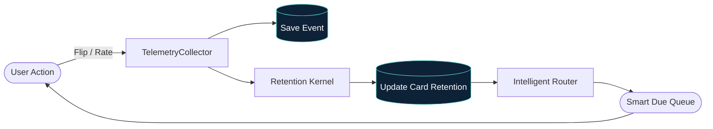

# Cognitive Telemetry & Spaced Repetition Architecture

> Generated on August 18, 2026. Documenting the Cognitive Telemetry, SuperMemo Spaced Repetition Kernel, Intelligent Routing, and Memory Heatmap Subsystem.

---

## 1. System Topology & Decoupled Architecture

```mermaid
graph TD
  subgraph "Client Layer (UI)"
    FLASH[Flashcard Screen]
    HEATMAP[Memory Heatmap Component]
    BADGE[Retention Badges]
  end

  subgraph "Layer 1: Telemetry Ingestion"
    COLLECTOR[TelemetryCollector (Event Sink)]
    STORAGE[(LocalStorage: mold_v2_telemetry)]
  end

  subgraph "Layer 2: Domain Math Kernel"
    KERNEL[Retention Kernel (Pure Math)]
    SM2[SM-2 / SM-18 Interval Calculator]
    EBBINGHAUS[Ebbinghaus Decay: R = e^(-t/S)]
  end

  subgraph "Layer 3: Action & Decision Engines"
    ROUTER[Intelligent Routing Engine]
    FATIGUE[Cognitive Fatigue Detector]
    QUEUE[Smart Review Queue]
  end

  FLASH -->|records card_flipped, rating_submitted| COLLECTOR
  COLLECTOR --> STORAGE
  FLASH -->|requests due items| ROUTER
  HEATMAP -->|inspects matrix| KERNEL
  ROUTER -->|evaluates decay| KERNEL
  KERNEL --> SM2
  KERNEL --> EBBINGHAUS
  ROUTER --> QUEUE
  QUEUE --> FLASH
  COLLECTOR -->|telemetry stream| FATIGUE
```

---

## 2. Mathematical Formulations

### A. Ebbinghaus Memory Decay
The probability of correct recall $R(t)$ over elapsed time $t$ (days) given stability $S$ (half-life in days):
$$R(t) = \exp\left(-\frac{t}{S}\right)$$

### B. Cognitive Latency Weighting
When decision latency $\Delta t > 7000\text{ms}$, the effective recall quality $q \in \{1, 3, 4, 5\}$ is downgraded by 1 unit to reflect struggling or hesitant recall:
$$q_{\text{eff}} = \begin{cases} q - 1 & \text{if } \Delta t > 7000\text{ms} \text{ and } q \ge 4 \\ q & \text{otherwise} \end{cases}$$

### C. Ease Factor ($EF$) Evolution
$$EF' = \max\left(1.3, EF + \left(0.1 - (5 - q_{\text{eff}}) \cdot (0.08 + (5 - q_{\text{eff}}) \cdot 0.02)\right)\right)$$

### D. Urgency Tiers
| Tier | Retention $R$ | Action Priority | Visual Badge |
|---|---|---|---|
| `CRITICAL_LAPSED` | $R < 0.50$ | Priority 1 | Red / Destructive |
| `DUE` | $0.50 \le R < 0.75$ | Priority 2 | Orange Accent |
| `APPROACHING_DECAY` | $0.75 \le R < 0.90$ | Priority 3 | Amber Accent |
| `NEW` | Unreviewed | Priority 4 | Panel Outline |
| `MASTERED` | $R \ge 0.90$ | Priority 5 | Emerald / Green |

---

## 3. Data Flow Diagram


