# Data Flow Diagram (Dimension 2)

> Generated by Graphify on June 8, 2026. Last updated: June 8, 2026.

## Diagram

```mermaid
flowchart LR
  classDef async fill:#1a1a2e,stroke:#e94560,color:#fff
  classDef error fill:#2d0000,stroke:#ff4444,color:#fff
  classDef store fill:#0d2137,stroke:#4ecdc4,color:#fff

  JSON_Input([Pasted AI JSON]) --> SchemaValidate{Zod Schema Validation}
  SchemaValidate -->|invalid| ErrReport([Fix/Error Log]):::error
  SchemaValidate -->|valid| Sanitizer[isomorphic-dompurify Sanitization]
  Sanitizer --> DB_Store[(LocalStorage / IndexedDB)]:::store

  DB_Store --> SubjectStore[active-subject-store]
  SubjectStore --> GameEngine[game-engine.tsx State Builder]
  
  GameEngine --> PlayerAnswer{Player Option Select}
  PlayerAnswer -->|correct| StreakIncrement[Streak & Shield Logic]
  PlayerAnswer -->|incorrect/hint| StudyDeck[Cheat Sheet Terminal Logger]
  
  StreakIncrement --> RunRecorder[Session Completed]
  StudyDeck --> RunRecorder
  RunRecorder --> RecordPersist[(Save RunRecord & Stats)]:::store
  RunRecorder --> AchievementEval[Achievement Evaluator]:::async
  AchievementEval --> ShowToast[Unlock Toast Alert]:::async
```

## Analysis Notes

- **Critical paths:** The active question ingestion from user text box input inside the `AddQuestionsWizard` down to persistence is highly critical. A single parsing crash will break the subject persistence structure.
- **Risk areas:** Error paths in Zod validation must auto-repair common AI JSON syntax flaws (like missing commas or unescaped backslashes in code snippets).
- **Stale/dead code suspects:** None.
