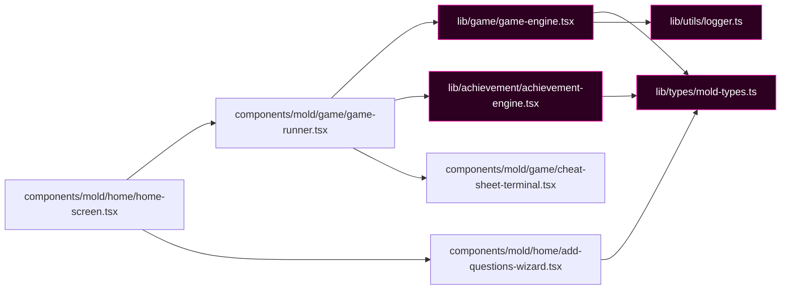

# Component Dependency Graph (Dimension 3)

> Generated by Graphify on June 8, 2026. Last updated: June 8, 2026.

## Diagram

## Analysis Notes

- **Hub nodes:** 
  - `lib/types/mold-types.ts`: Holds all central types (MCQ, Question, GamePhase, GameState, etc.) and utilities.
  - `lib/game/game-engine.tsx`: Drives the core game phase updates and context hooks.
- **Circular dependencies:** None detected in the static imports analysis.
- **Orphan components:** None.
