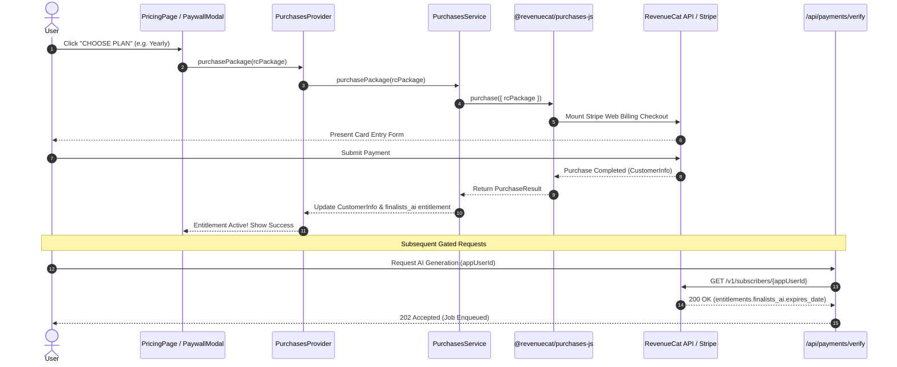
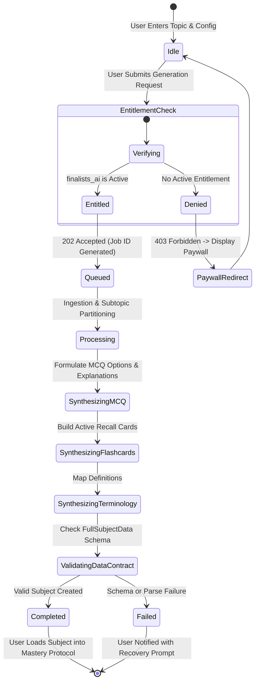

# Finalists AI: RevenueCat Payments & AI Synthesis Architecture

> Living Architecture Document — MOLD V2 Finalists AI Module

---

## 1. System Topology & Subsystems

```mermaid
graph TD
    subgraph Client Layer [Next.js App Router Client]
        TopNav[TopNavBar / AI Pass Badge]
        PricingRoute[/pricing - Made with RevenueCat]
        Paywall[PaywallModal]
        Context[PurchasesProvider / usePurchases]
        Service[PurchasesService Singleton]
    end

    subgraph RevenueCat Layer [RevenueCat Web Infrastructure]
        RCSDK[@revenuecat/purchases-js]
        RCBackend[RevenueCat REST API v1]
        CustCenter[Hosted Customer Center]
        StripeGateway[Stripe Web Billing Checkout]
    end

    subgraph Backend Layer [Next.js API Route Handlers]
        VerifyAPI[/api/payments/verify]
        WebhookAPI[/api/payments/webhook]
        AiGenerateAPI[/api/ai/generate]
        AiStatusAPI[/api/ai/status/[jobId]]
        JobStore[AiJobStore / Subject Synthesizer]
    end

    TopNav -->|Opens Modal / Navigates| PricingRoute
    PricingRoute --> Context
    Paywall --> Context
    Context --> Service
    Service --> RCSDK
    RCSDK --> StripeGateway
    RCSDK --> RCBackend
    RCBackend --> CustCenter

    VerifyAPI -->|Verify Entitlement| RCBackend
    RCBackend -->|Webhook Events| WebhookAPI

    PricingRoute -->|Trigger AI Gen| AiGenerateAPI
    AiGenerateAPI -->|Verify Entitlement| RCBackend
    AiGenerateAPI -->|Enqueue| JobStore
    AiStatusAPI -->|Poll Status| JobStore
```

---

## 2. Sequence Flow: Subscription Checkout & Entitlement Verification



---

## 3. State Machine: AI Subject Generation Pipeline



---

## 4. Webhook Ingestion & Lifecycle Events

```mermaid
graph LR
    RC[RevenueCat Engine] -->|POST Payload| Handler[/api/payments/webhook]
    Handler --> Auth{Verify Token}
    Auth -->|Valid| Dispatcher[Event Dispatcher]
    Auth -->|Invalid| Reject[401 Unauthorized]

    Dispatcher -->|INITIAL_PURCHASE| Log1[Log & Grant Access]
    Dispatcher -->|RENEWAL| Log2[Extend Expiration Timestamp]
    Dispatcher -->|CANCELLATION| Log3[Flag Subscription Inactive]
    Dispatcher -->|EXPIRATION| Log4[Revoke finalists_ai Access]
    Dispatcher -->|PRODUCT_CHANGE| Log5[Update Tier Mapping]
```

---

## 5. Entitlement & Product Matrix

| Plan Tier | Product ID | Entitlement ID | Duration | Self-Service Management |
|-----------|------------|----------------|----------|-------------------------|
| **Monthly Access** | `finalists_ai_monthly` | `finalists_ai` | 30 Days Auto-renew | Customer Center (`managementURL`) |
| **Annual Mastery** | `finalists_ai_yearly` | `finalists_ai` | 365 Days Auto-renew | Customer Center (`managementURL`) |
| **Lifetime Founder** | `finalists_ai_lifetime` | `finalists_ai` | Perpetual (Null Expiry) | RevenueCat Hosted Portal |

---

## 6. Resilience & Offline Fallbacks

1. **Client Fallback:** If the client is offline or RevenueCat offerings fail to fetch, static fallback plan data from `FINALISTS_AI_PLANS` is displayed with graceful error recovery.
2. **Server Fallback:** If the server cannot reach RevenueCat during verification, non-fatal default responses are returned rather than unhandled 500 crashes.
3. **Secret Isolation:** Public API key `test_zbsWleAbNOTjaFGkdkzKahntsit` is scoped only to client SDK operations; server operations support dedicated `REVENUECAT_SECRET_KEY` and `REVENUECAT_WEBHOOK_AUTH_TOKEN`.
