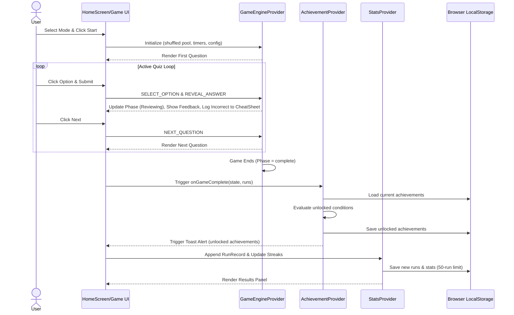

# Sequence Flow Diagram (Dimension 5)

> Generated by Graphify on June 8, 2026. Last updated: June 8, 2026.

## Diagram

## Analysis Notes

- **Optimizations:** Async execution of achievement checking and localStorage saves prevents UI lag at the end of a session.
- **Race conditions:** `achievementsFiredRef` is used as a guard to ensure `onGameComplete` fires exactly once per run.
- **Offline-First:** No external server calls are made during the entire loop, ensuring absolute privacy and zero lag.
