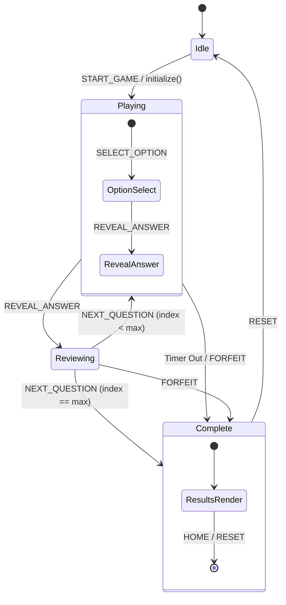

# State Machine Diagram (Dimension 4)

> Generated by Graphify on June 8, 2026. Last updated: June 8, 2026.

## Diagram

## Analysis Notes

- **Critical paths:** The transition from `Playing` to `Reviewing` updates the streak shield counter, streak metrics, and logs any incorrect answers to the Cheat Sheet Terminal context.
- **Terminal states:** `Complete` is the terminal state where the final runs record is evaluated and saved into LocalStorage, and achievements are checked and unlocked.
- **Risk areas:** Timer ticking on `Playing` state can force transition to `Complete` automatically if time expires.
