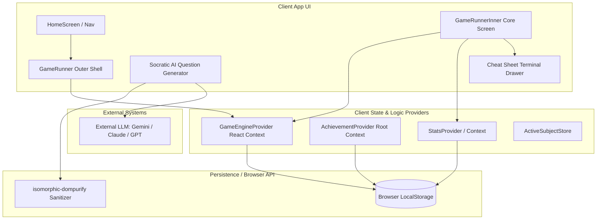

# System Topology (Dimension 1)

> Generated by Graphify on June 8, 2026. Last updated: June 8, 2026.

## Diagram

## Analysis Notes

- **Critical paths:** The interaction between `GameRunnerInner` and `GameEngineProvider` is the main loop of the app. It reads and writes active quiz state.
- **Risk areas:** The `AddQuestionsWizard` directly compiles prompt outputs that are pasted back into the browser. If the input is not sanitized properly, it could lead to XSS. `isomorphic-dompurify` is used to mitigate this.
- **Stale/dead code suspects:** None. The architecture is lean and offline-first.
