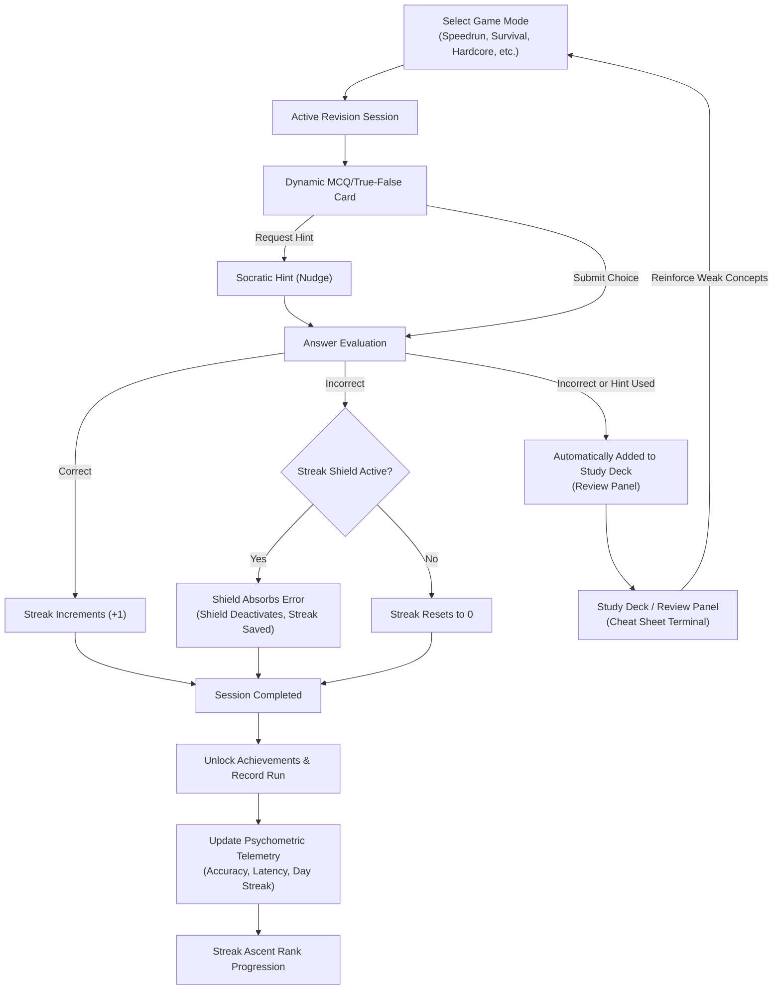

# Compelling & Attractive Features Analysis (MOLD V2)

This document presents a research analysis of the most compelling and attractive features of the MOLD V2 ("Mastery Protocol") platform from both a student-engagement and academic-utility perspective. It breaks down the visual design, gamified mechanics, cognitive scaffolding, and the developer-to-student content pipelines that define the platform's unique value proposition.

---

## The Core Student Learning Loop

The platform's engaging experience is driven by a highly gamified, self-reinforcing learning loop. The flow below maps out how students interact with the core game modes, adaptive UI systems, and persistent reward loops:

---

## 1. High-Fidelity Monospace Neo-Brutalist Aesthetic
At first glance, students are drawn in by a distinct, polished **dark-first monospace data aesthetic** that feels like a premium developer console rather than a generic quiz app:
* **The CRT Aesthetic:** Features like subtle `scanlines` patterns and interactive color-coded glows (`border-glow`, `border-glow-success`, `border-glow-danger`) make the interface feel responsive and alive.
* **Typographic Rigor:** The layout utilizes a clean typography combination (sans-serif for readable questions, strict monospace `Geist Mono` for UI metrics, code snippets, and numerical logs) that ensures high information density without clutter.
* **Accessibility Integrated:** Decoration icons are hidden from screen readers (`aria-hidden="true"`), clickable targets have solid focus states (`focus-visible`), and live regions (`aria-live="polite"`) notify students of dynamic state updates in real-time.

---

## 2. Dynamic Gamification & Streak Preservation Systems
To encourage daily study habits, MOLD V2 applies a game-theoretic approach to study retention:
* **Flame Rank Progression ([StreakAscent](file:///d:/Study/Programming/Projects/finalsv2/finals-qb/components/mold/home/streak-ascent.tsx)):** A custom vertical-ascent dashboard that charts the student's daily streak against defined ranks (from `SPARK` up to `ETERNAL`). The UI displays ambient glowing flames, upcoming milestones, and a warning notification if their streak is currently "at risk" (hasn't been maintained today).
* **The Streak Shield ([evaluateStreakAndShield](file:///d:/Study/Programming/Projects/finalsv2/finals-qb/lib/game/streak-shield-logic.ts)):** A highly requested student feature. Reaching a consecutive streak of 5 correct answers automatically grants a "Streak Shield." The next time a student makes a mistake, the shield absorbs the error (deactivating itself) rather than resetting the student's streak to zero, preventing the frustration of accidental streak loss.
* **Daily Objectives & Milestones ([StatsScreen](file:///d:/Study/Programming/Projects/finalsv2/finals-qb/components/mold/home/stats-screen.tsx)):** Prominently displays daily revision missions (e.g., complete 3 runs) and long-term milestones (e.g., maintain a 15-day streak) with active progress bars to reinforce daily habits.

---

## 3. Diverse, Multi-Flavor Game Modes
The platform caters to different student learning styles and cognitive states through 7 game modes defined in [game-engine.tsx](file:///d:/Study/Programming/Projects/finalsv2/finals-qb/lib/game/game-engine.tsx):
1. **Speedrun (Timed):** A global 5-minute limit to train speed-of-recall and fluency.
2. **Blitz (Timed):** A fast-paced 2-minute limit designed for high-stress, rapid decision-making.
3. **Hardcore:** Shuffles only "Hard" difficulty questions. Using hints is penalized or blocked.
4. **Survival (Lives-based):** Students start with 3 lives. The per-question timer starts at 15 seconds and decreases by 1 second for every 5 questions answered, testing endurance and rapid logic.
5. **Practice:** Untimed, category-focused review (e.g. studying SOLID principles or OOP in isolation).
6. **Full Revision:** A complete, non-randomized review in the exact sequence of the curriculum to verify systematic coverage.
7. **Flashcards:** An offline cards deck where students flip cards to check key terminology and sort them into "Got It" and "Still Learning" buckets.

---

## 4. LearnLM-Aligned Socratic Scaffolding & Explanations
Rather than encouraging rote memorization, MOLD V2 infuses Google's LearnLM pedagogical principles:
* **Socratic Nudges:** Hint panels do not reveal the answer. Instead, they nudge the student by breaking down the question's core mechanism and asking a targeted guiding question.
* **Metacognitive Explanations:** Explanations detail exactly *why* the correct answer is right and *why* the other distractors are wrong. This tackles common misconceptions directly at the moment of failure.
* **Dynamic Option Shuffling:** On every quiz load, question options are dynamically randomized. This prevents students from memorizing answer locations (e.g. "it's always option B") and forces true comprehension of the text.

---

## 5. The Cheat Sheet Terminal ([CheatSheetTerminal](file:///d:/Study/Programming/Projects/finalsv2/finals-qb/components/mold/game/cheat-sheet-terminal.tsx))
An interactive, slide-out drawer panel acting as the student's personal study deck:
* **Automatic Logging:** Any question answered incorrectly or where a hint was requested is automatically added to this review deck during a study session.
* **On-Demand Review:** Accessible instantly via the global hotkey `Ctrl + \`` (Backtick). Students can scroll through their flagged questions, view the full option list, see the highlighted correct answer, and re-read the Socratic explanation at any time.
* **Cognitive Offloading:** Allows students to continue their quiz session without getting bogged down, knowing that their mistakes are safely logged and ready for focused post-session study.

---

## 6. Socratic AI Question Generator ([AddQuestionsWizard](file:///d:/Study/Programming/Projects/finalsv2/finals-qb/components/mold/home/add-questions-wizard.tsx))
A powerful tool bridging the gap between student customization and AI generation:
* **Custom Bias & Settings:** Users can select what type of material to generate (questions, flashcards, or both), quantity, category focus, and style bias (e.g. theoretical vs technical code-focused questions with Mermaid state/class diagrams).
* **Automated Prompt Compiler:** Translates these parameters into a highly optimized, LearnLM-compliant prompt block that can be copied to Gemini or Claude.
* **Direct Integration & Merging:** Students paste the AI-generated JSON back into the wizard. The platform validates the structure against its schema, auto-repairs escaping issues (such as backslashes for math/code), and merges the new questions into the subject without duplicates.

---

## 7. Performance & Psychometric Telemetry
* **Latency Indicators ([TelemetryPanel](file:///d:/Study/Programming/Projects/finalsv2/finals-qb/components/mold/home/telemetry-panel.tsx)):** Measures and visualizes the student's average response time (latency) in milliseconds, charting it against speeds like "Rapid" (<1s) and "Nominal" (2.5s) to track fluency.
* **Pass/Expert/Master Milestones:** Accurately visualizes accuracy rates with dynamic threshold labels (60% Pass, 80% Expert, 90% Master, 97% S+) so students know exactly how close they are to complete mastery.
* **Offline-First Resilience:** Persists all logs and records locally using asynchronous adapters, offering lightning-fast loads and guaranteeing that progress is never lost due to flaky internet connections.
